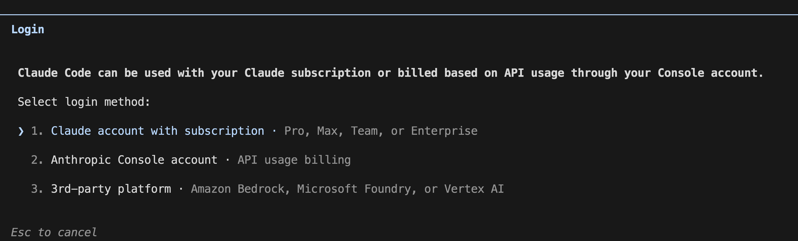
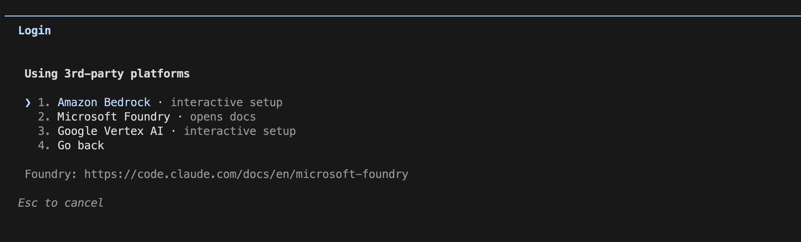
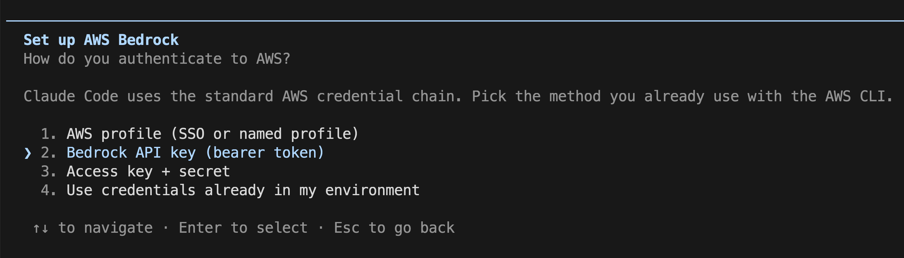
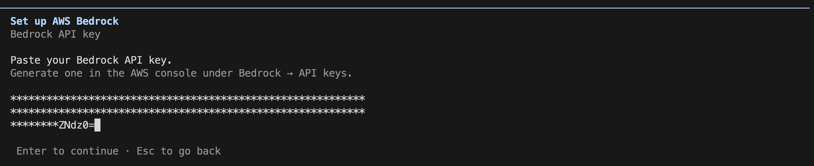
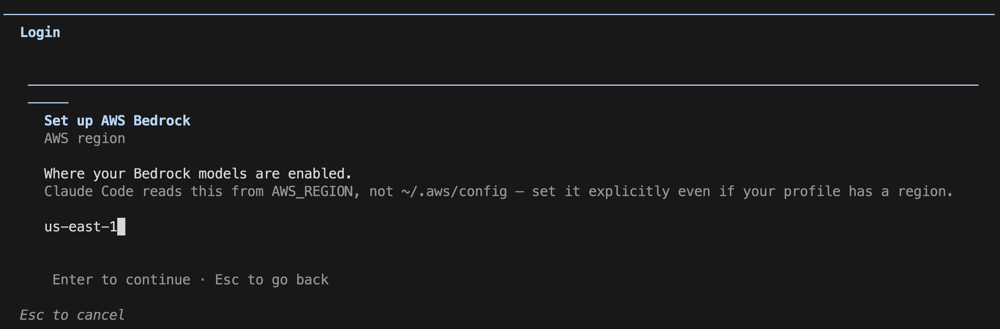
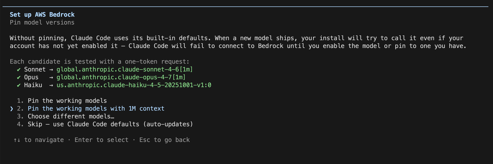

# 개발 환경 설치 가이드

워크숍에 필요한 도구를 설치하고 **Claude Code 를 Bedrock 자격증명으로 동작하는 상태**까지 만드는 전체 과정을 담고 있습니다. 순서대로 따라가면 됩니다.

## 문서에서 쓰는 표기

이 문서는 **두 개의 서로 다른 입력창**을 오갑니다. 헷갈리지 않도록 아이콘으로 구분합니다.

| 표기                      | 의미                                                                                 |
| ------------------------- | ------------------------------------------------------------------------------------ |
| 💻 **터미널**             | Mac 의 터미널(또는 Ghostty) 또는 Windows 의 PowerShell. 시스템 명령을 입력하는 창.   |
| 💬 **Claude Code 대화창** | 터미널에서 `claude` 를 실행한 뒤 나타나는 AI 와의 대화창. 자연어 문장을 입력하는 곳. |

---

## 0. 사전 준비: 터미널 여는 법

이 가이드에서 말하는 "💻 터미널" 은 아래와 같이 엽니다.

### Windows — PowerShell (관리자 권한) 여는 법

1. 작업 표시줄의 **시작(⊞)** 버튼을 클릭하거나, 키보드의 **Windows 키** 를 누릅니다.
2. `powershell` 이라고 입력합니다.
3. 검색 결과에서 **"Windows PowerShell"** 또는 **"PowerShell"** 을 **우클릭 → "관리자 권한으로 실행"** 을 선택합니다.
4. "이 앱이 디바이스를 변경할 수 있도록 허용하시겠습니까?" 창이 뜨면 **예**를 클릭합니다.
5. 파란색(또는 검은색) 창이 열립니다. 이 창이 💻 **터미널** 입니다. 창 제목에 **"관리자:"** 가 붙어있는지 확인하세요.

> **Tip**: 일반 PowerShell 창이라면 뒤의 `npm install -g` 단계에서 권한 오류가 납니다. 반드시 **관리자 권한** 으로 여세요.

### Mac — 터미널 여는 법

1. 키보드에서 **⌘(Command) + Space** 를 눌러 Spotlight 를 엽니다.
2. `termnial` 이라고 입력하고 Enter.
3. 검은색 창이 열립니다. 이 창이 💻 **터미널** 입니다.

---

## 1. 원라이너 설치 (Mac / Windows 공통)

필요한 도구(Node.js, Claude Code) 를 한 번에 설치합니다. 💻 터미널에 **아래 한 줄을 그대로 복사해서 붙여넣고 Enter** 를 누르세요.

**Mac** — 💻 터미널:

```bash
curl -fsSL https://raw.githubusercontent.com/haandol/ui-poc-workspace/main/scripts/install-claude-code.sh | bash
```

**Windows** — 💻 PowerShell (관리자 권한) 에서:

```powershell
iwr -useb https://raw.githubusercontent.com/haandol/ui-poc-workspace/main/scripts/install-claude-code.ps1 | iex
```

설치는 약 3~5분 소요됩니다. **"Claude Code is ready"** 와 유사한 메시지가 나오면 완료.

원라이너가 내부적으로 실행하는 것은 (1) Homebrew/winget 확인, (2) Node.js LTS 설치, (3) `npm install -g @anthropic-ai/claude-code` 세 단계입니다.

**설치 확인** — 💻 터미널에서:

```bash
claude --version
```

버전 번호가 출력되면 설치 성공입니다.

---

## 2. Claude Code 실행

연습용 폴더를 만들고 Claude Code 대화창을 엽니다.

**Mac** — 💻 터미널:

```bash
mkdir -p ~/Desktop/claude-play && cd ~/Desktop/claude-play && claude
```

**Windows** — 💻 PowerShell:

```powershell
$desktop = [Environment]::GetFolderPath('Desktop')
New-Item -ItemType Directory -Path "$desktop\claude-play" -Force | Out-Null
cd "$desktop\claude-play"
claude
```

💬 Claude Code 대화창이 열리고 프롬프트 커서가 깜박이면 다음 단계로 넘어갑니다.

---

## 3. Bedrock 자격증명 등록

Claude Code 를 **처음 실행**하면 어떤 provider(Anthropic / Bedrock / Vertex AI 등) 를 쓸지 선택하는 화면이 자동으로 뜹니다. 바로 아래 **3-1** 로 넘어가세요.

> **provider 선택 화면이 안 뜨거나, 이미 다른 계정으로 로그인된 상태라면** 대화창에 `/login` 을 타이핑해 같은 화면을 다시 불러올 수 있습니다.

### 3-1. provider 선택 (1단계)

**Select login method** 화면에서 **`3` 을 눌러** `3rd-party platform` 을 선택하고 Enter.



### 3-2. Amazon Bedrock 선택 (2단계)

**Using 3rd-party platforms** 화면에서 **`1` 을 눌러** `Amazon Bedrock · interactive setup` 을 선택하고 Enter.



### 3-3. 인증 방법 선택

**인증 방법 선택** 화면이 뜨면 **`2` 를 눌러** `Bedrock API key (bearer token)` 를 선택하고 Enter. **Bedrock API 키** 방법이 가장 간단하므로 권장합니다.



### 3-4. API 키 붙여넣기

**Bedrock API key** 입력 화면에서 진행자에게 전달받은 API 키를 붙여넣고 Enter.



### 3-5. AWS region 입력

**AWS region** 입력 화면에서 반드시 `us-west-2` 를 입력하고 Enter.



> Claude Code 는 `~/.aws/config` 가 아니라 `AWS_REGION` 환경변수를 읽기 때문에, 프로필에 리전이 있더라도 여기에서 명시적으로 지정해야 합니다.

### 3-6. 모델 버전 핀 고정

**모델 버전 핀 고정** 화면에서 **`2` 를 눌러** `Pin the working models with 1M context` 를 선택하고 Enter. 환경변수를 직접 설정할 필요가 없습니다.



### 3-7. 동작 확인

💬 대화창에 아래처럼 테스트 질문을 입력해 응답이 오는지 확인합니다.

```
hi
```

응답이 오면 설치 + 자격증명 등록까지 모두 완료입니다.

> **Workshop Studio 자격 증명은 일정 시간 후 만료됩니다.** Claude Code 가 갑자기 동작하지 않으면 `/setup-bedrock` 을 다시 실행해 재입력하세요.

---

## 4. 트러블슈팅

| 증상                                        | 해결 방법                                                                                      |
| ------------------------------------------- | ---------------------------------------------------------------------------------------------- |
| `npm install -g` 에서 권한 오류 (Mac)       | `sudo npm install -g @anthropic-ai/claude-code`                                                |
| `npm install -g` 에서 권한 오류 (Windows)   | PowerShell 을 **관리자 권한** 으로 다시 실행 후 시도                                           |
| `node` / `claude` 명령을 못 찾음 (Windows)  | PowerShell 창을 닫고 다시 연 뒤 재시도 (환경 변수 갱신 필요)                                   |
| winget 이 없거나 작동하지 않음 (Windows)    | [https://nodejs.org/ko/download](https://nodejs.org/ko/download) 에서 LTS `.msi` 직접 다운로드 |
| `/setup-bedrock` 입력 후 응답이 없음        | 자격증명이 만료됐을 수 있음. 진행자에게 새 자격증명 요청 후 재입력                             |
| `on-demand throughput isn't supported` 오류 | 진행자에게 문의                                                                                |

---

## 부록: 단계별 수동 설치 / 전체 프로젝트 환경

원라이너 대신 단계별로 직접 설치하거나, 2일차용 전체 프로젝트 환경(Git, pnpm, 의존성 등)을 세팅해야 한다면 아래 가이드를 참고하세요.

- **[Windows 수동 설치 가이드](./INSTALLATION_WIN.md)**
- **[Mac 수동 설치 가이드](./INSTALLATION_MAC.md)**
