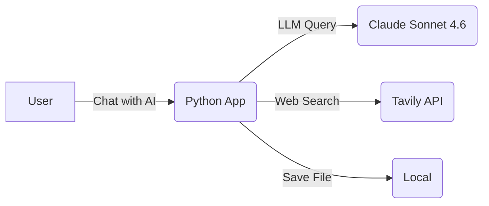

<section_guide number="4" title="High-Level Architecture">
<purpose>Describe the system architecture using C4 model Context and Container diagrams</purpose>

<questions>
1. What are the main components of the system?
2. Are there any external system/service integrations?
3. What is the rationale for the technology stack choices?
</questions>

<example>
### 4.1 System Diagram

### 4.2 Technology Stack
| Component | Technology |
|-----------|-----------|
| Frontend & Backend | Python (Chainlit) |
| LLM API | Amazon Bedrock, Langchain |
| Web Search API | Tavily API |
</example>

<completion>Include Context/Container diagram descriptions</completion>
</section_guide>
