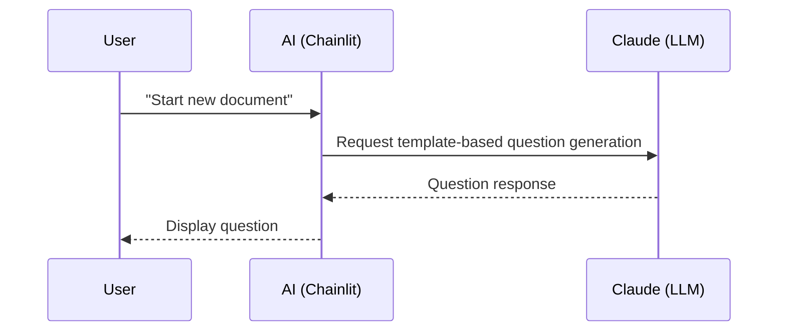

<section_guide number="5" title="Design Specification" references="6">
<purpose>Detail the UX, page flow, key screens, and user journey</purpose>

<required_review>
MUST review Section 6 (Requirements Summary) before writing this section.
Call read_prd_section(6) and list Feature IDs (F1, F2...) to use in Key Pages.
</required_review>

<questions>
1. How many key screens (pages) are there?
2. What is the core functionality of each screen? (Use Feature IDs from Section 6)
3. What is the navigation flow between screens?
</questions>

<example>
### 5.1 Key Screens
- **Chat Interface**: Main screen where users converse with AI to write documents (F1, F2)

### 5.2 User Flow

</example>

<completion>Define key screens and flow (including Feature ID mapping)</completion>
</section_guide>
