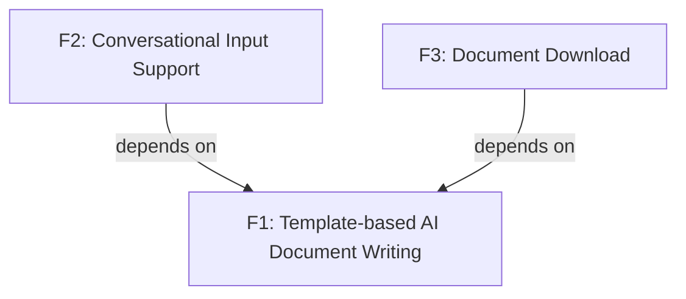

<section_guide number="6" title="Requirements Summary">
<purpose>Enumerate functional/non-functional requirements and assign priorities</purpose>

<questions>
1. List the core functional requirements
2. What is the priority of each requirement? (Must-Have / Should-Have / Nice-to-Have)
3. What are the non-functional requirements? (up to 3)
</questions>

<workflow>
After completing 6.1 and 6.2:
1. Analyze the features defined in 6.1 and automatically infer dependency relationships between them
2. Generate a Mermaid dependency diagram (graph TD) for Section 6.3
3. Present the generated diagram to the user and ask for confirmation or corrections
4. Do NOT ask the user to describe dependencies from scratch — propose your analysis first
</workflow>

<example>
### 6.1 Functional Requirements
- **F1: Template-based AI Document Writing** - AI generates documents based on a predefined PRD template, reflecting user input
- **F2: Conversational Input Support** - Users can fill in the document step by step through conversation with AI
- **F3: Document Download** - Download the completed document in Markdown format

### 6.2 Non-Functional Requirements

- **NF1: Performance** - Support 1,000 concurrent users, document generation within 30 seconds
- **NF2: Security** - OAuth authentication via AWS Cognito

### 6.3 Feature Dependency Diagram

</example>

<important>Assign a unique ID to each functional requirement (F1, F2, ...)</important>
<completion required="true">Confirm after all requirements have been assigned IDs</completion>
</section_guide>
