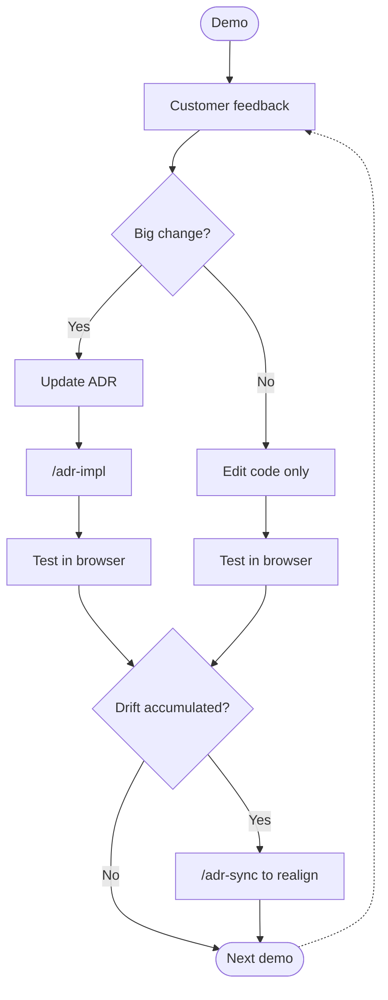

The moment you demo a PoC, **feedback is guaranteed**: "Move the button up", "Let's change the payment flow", "Drop this screen entirely and try a different journey." The requests never stop.

The PoC you build in this lab is designed to **absorb those changes indefinitely**. The key is treating the **ADR as the source of truth** for every decision.

## Types of changes and how to respond

### Scenario A. Big change — update the ADR first

Adding/removing a feature, changing a flow, restructuring — anything where **the decision itself changes**.

💬 Example — customer feedback: _"Switch payment options from cards to a dropdown."_

:::code{showCopyAction=true showLineNumbers=false language=text}
We're switching payment options from cards to a dropdown.
Update the ADR first.
:::

Claude updates the **Decision** and **Consequences** in `docs/adr/f2/0001-…md`, then runs `/adr-impl f2` to reflect the change in code.

### Scenario B. Small change — fix code directly

Color, font size, copy, micro-positioning — **finishing touches that aren't decisions**.

💬 Example:

:::code{showCopyAction=true showLineNumbers=false language=text}
Make the payment button bigger and use the primary color.
:::

In this case, you can edit the code without updating the ADR. **But if B accumulates, you fall into Scenario C.**

### Scenario C. Drift accumulates — realign with `/adr-sync`

After several small edits, code and ADR can drift apart. If a big change request arrives in that state, **the AI doesn't know which one to trust.**

💬 Input:

:::code{showCopyAction=true showLineNumbers=false language=text}
/adr-sync f2
:::

Claude automatically:

1. Reads every ADR and the code under the f2 category, finding any drift
2. Updates the ADR body **using code as the source of truth**
3. Syncs the `docs/adr/README.md` index along with it

::alert[`/adr-sync` is the step that realigns things in one go when you've accumulated changes without updating the ADR. You don't need it every time — running it **once a feature stabilizes**, or **before accepting the next big change request**, is enough.]{type="info"}

## The infinite cycle of change

**Customer requirements always change.** Follow this cycle and your PoC absorbs the next round of changes from a clean state every time — six months from the day you first built it, the flow is still the same.
