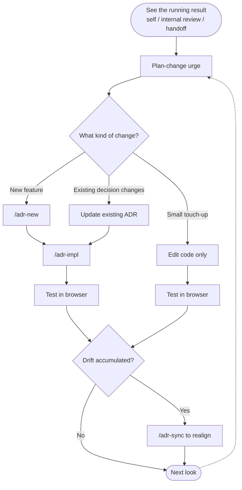

This whole workshop is built around **running the "plan → build → see it → re-plan" loop as fast as possible.** The instant an idea you've only had in your head shows up as a **working screen**, _"hmm, now that I see it, I'd actually do this differently"_ almost always follows — inside your own head, in an internal review, the moment before handing it to engineering.

The PoC you build in this lab is designed to **absorb that constant re-planning, indefinitely.** The key is treating the **ADR as the source of truth** for every decision — update the ADR first whenever the plan shifts, then push it into code, and the PoC stays in a clean state for the next 100 changes.

## Types of changes and how to respond

### Scenario A. Big change — update the ADR first

Anything where **the decision itself changes** for an existing feature — flow, structure, or behavior.

💬 Example — internal review feedback: _"Switch payment options from cards to a dropdown."_

:::code{showCopyAction=true showLineNumbers=false language=text}
We're switching payment options from cards to a dropdown.
Update the ADR first.
:::

Claude updates the **Decision** and **Consequences** in `docs/adr/f2/0001-…md`, then runs `/adr-impl f2` to reflect the change in code.

### Scenario A2. Brand-new feature — start with `/adr-new`

When the request is a **brand-new feature that didn't exist in the PRD** (e.g., _"also add a coupon code field on the checkout screen"_), don't backtrack to the PRD — author a fresh ADR directly with `/adr-new`.

:::code{showCopyAction=true showLineNumbers=false language=text}
/adr-new add a coupon code input on the checkout screen
:::

Claude automatically:

1. Creates a new category (e.g., `coupon`) and the ADR file (`docs/adr/coupon/0001-…md`)
2. Fills in **Decision, Alternatives, Consequences** and asks for your approval
3. Once approved, run `/adr-impl coupon` to push the change into code

::alert[`/adr-new` is the path for ad-hoc changes the PRD never anticipated. Once registered as an ADR, the new decision evolves through the same change cycle as everything else.]{type="info"}

### Scenario B. Small change — fix code directly

Color, font size, copy, micro-positioning — **finishing touches that aren't decisions**.

💬 Example:

:::code{showCopyAction=true showLineNumbers=false language=text}
Make the payment button bigger and use the primary color.
:::

In this case, you can edit the code without updating the ADR. **But if B accumulates, you fall into Scenario C.**

### Scenario C. Drift accumulates — realign with `/adr-sync`

After several small edits, code and ADR can drift apart. If a big change request arrives in that state, **the AI doesn't know which one to trust.**

💬 Input:

:::code{showCopyAction=true showLineNumbers=false language=text}
/adr-sync f2
:::

Claude automatically:

1. Reads every ADR and the code under the f2 category, finding any drift
2. Updates the ADR body **using code as the source of truth**
3. Syncs the `docs/adr/README.md` index along with it

::alert[`/adr-sync` is the step that realigns things in one go when you've accumulated changes without updating the ADR. You don't need it every time — running it **once a feature stabilizes**, or **before accepting the next big change request**, is enough.]{type="info"}

## The infinite cycle of change

**Requirements always change.** Follow this cycle and your PoC absorbs the next round of changes from a clean state every time — six months from the day you first built it, the flow is still the same.
