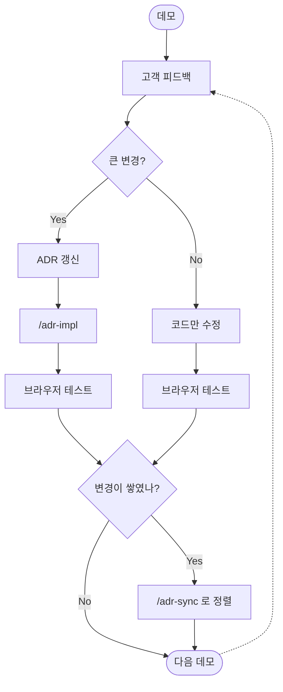

PoC 를 데모하면 **반드시 피드백이 옵니다.** "버튼 위치 바꿔주세요", "결제 방식을 바꿉시다", "이 화면을 통째로 빼고 다른 흐름으로 가시죠" 같은 요청이 끊이지 않습니다.

이 랩에서 만든 PoC 는 **그 변경을 무한히 반복할 수 있도록** 설계되어 있습니다. 핵심은 **ADR 을 결정의 source of truth (기준점)** 로 두는 것입니다.

## 변경의 종류와 대응 방법

### 시나리오 A. 큰 변경 — ADR 먼저 갱신

기능 추가/제거, 흐름 변경, 구조 변경처럼 **결정 자체가 바뀌는 경우** 입니다.

💬 예시 — 고객 피드백: _"결제 옵션을 카드형이 아니라 드롭다운으로 바꿉시다."_

:::code{showCopyAction=true showLineNumbers=false language=text}
결제 옵션 선택을 카드형에서 드롭다운으로 바꾸려고 해.
ADR 먼저 갱신해줘.
:::

Claude 가 `docs/adr/f2/0001-…md` 의 **Decision** 과 **Consequences** 를 갱신합니다. 그 다음 `/adr-impl f2` 로 코드까지 반영합니다.

### 시나리오 B. 작은 변경 — 코드만 빠르게

색상, 폰트 크기, 문구, 미세 위치 조정 같은 **결정 수준이 아닌 마감 작업** 입니다.

💬 예시:

:::code{showCopyAction=true showLineNumbers=false language=text}
결제 버튼을 더 크게, 메인 색상으로 강조해줘.
:::

이 경우엔 ADR 을 갱신하지 않고 코드만 수정해도 됩니다. **단, B 가 누적되면 시나리오 C 로 넘어갑니다.**

### 시나리오 C. 변경이 쌓였을 때 — `/adr-sync` 로 정렬

작은 수정을 여러 번 거치면 코드와 ADR 이 어긋날 수 있습니다. 이 상태로 다음 큰 변경 요청이 오면 **AI 가 어느 쪽을 기준으로 봐야 할지 헷갈립니다.**

💬 입력:

:::code{showCopyAction=true showLineNumbers=false language=text}
/adr-sync f2
:::

Claude 가 자동으로:

1. f2 카테고리의 모든 ADR 과 코드를 읽고 어긋난 부분 (drift) 을 찾습니다
2. **코드를 기준으로** ADR 본문을 갱신합니다
3. `docs/adr/README.md` 인덱스도 함께 정렬합니다

::alert[`/adr-sync` 는 ADR 갱신을 깜빡한 변경이 쌓였을 때 한 번에 정렬하는 단계입니다. 매번 쓸 필요는 없고, **Feature 한 개가 어느 정도 안정됐을 때 한 번**, 또는 **다음 큰 변경 요청을 받기 전에 한 번** 돌리면 충분합니다.]{type="info"}

## 정리: 변경의 무한 사이클

**고객 요구사항은 언제든 바뀝니다.** 이 사이클을 따르면 PoC 는 매번 깨끗한 상태에서 다음 변경을 받을 수 있고, 처음 만든 그날부터 6 개월 뒤에도 동일한 흐름으로 진화시킬 수 있습니다.
