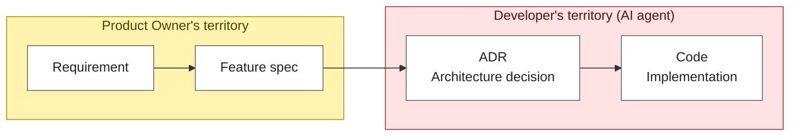
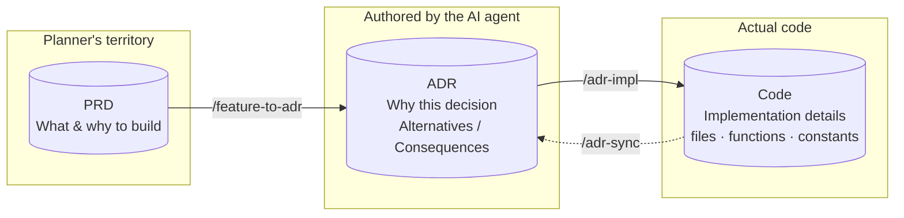

## Convert every feature into an ADR at once

In the 💬 Claude Code chat, run the command without arguments:

:::code{showCopyAction=true showLineNumbers=false language=text}
/feature-to-adr
:::

Claude will automatically:

1. Read **every feature (F1, F2, F3, …)** from PRD Section 7
2. Generate `docs/adr/<feature-id>/0001-…md` for each one in batch
3. Fill in **Decision, Alternatives, Consequences** for every ADR

::alert[ADR files are saved under `docs/adr/<feature-id>/`. You can open them directly in Finder/File Explorer or ask Claude _"show me the f1 ADR"_ if curious. **You don't need to read them to proceed** — the next page jumps straight into `/adr-impl`.]{type="info"}

## How PRD and ADR differ

The hardest part of agent-driven development is **translating business requirements into correct code.** The trick is breaking that translation into standardized abstraction layers, and **PRD vs. ADR sit at different layers in that pipeline.**

- **PRD — owned by the Product Owner / planner**: _"what to build and why"_, written in business language. Covers Requirement → Feature spec. You already wrote one in Lab 2.
- **ADR (Architecture Decision Record) — owned by the developer side**: a record of _"what structure was chosen and why"_ when building each feature. Implementation details (file paths, snippets, constants) live in the code itself; the ADR captures only the **reasoning (WHY), the alternatives considered, and the consequences** of the decision.

For a simple screen, you can get by without an ADR. But **as the feature count grows and the project gets more complex, separating PRD and ADR becomes essential.** When change requests come in after a demo, keeping _"what we agreed to build (PRD)"_ separate from _"why we made each decision (ADR)"_ lets you judge how far a new requirement reaches into existing decisions and keeps the cycle clean.

::alert[An ADR is ultimately a **technical decision record.** Non-developers don't need to write it themselves — **leave the authoring to an AI agent that knows development, then have it implement against those decisions.** The single command on this page converts every PRD feature into an ADR in one shot.]{type="info"}

