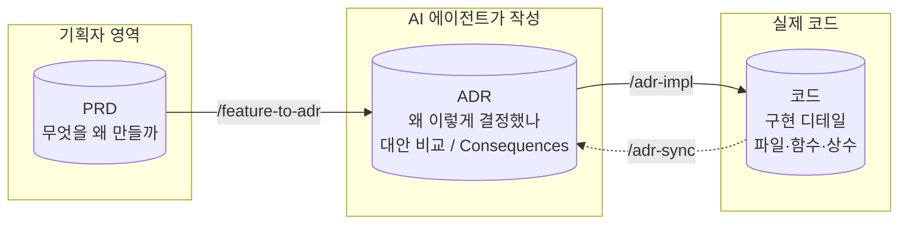

## PRD 와 ADR 은 어떻게 다른가

에이전트 기반 개발에서 가장 어려운 부분은 **비즈니스 요구사항을 코드로 정확히 변환** 하는 일입니다 (참고: [RFTCR Framework](https://haandol.github.io/2025/05/11/rftcr-framework-for-agentic-dev.html)). 그래서 요구사항 → 기능 → 코드 사이를 표준화된 추상화 단계로 잘게 끊어서 넘기는 것이 핵심이고, **PRD 와 ADR 은 그 변환 과정에서 서로 다른 추상화 단계를 담당** 합니다.

- **PRD — 기획자(Product Owner) 영역**: _"무엇을 왜 만들 것인가"_ 를 비즈니스 언어로 정리한 요구사항 문서. Lab 2 에서 이미 작성했습니다.
- **ADR (Architecture Decision Record) — 개발자 영역**: 그 기능을 만들 때 _"어떤 구조로 갈지, 왜 그 선택을 했는지"_ 를 남기는 **아키텍처 의사결정 기록**. 구현 디테일 (파일 경로, 코드 스니펫, 상수) 은 코드가 갖고 있고, ADR 에는 **결정의 근거 (WHY), 대안 비교, 그 결정의 영향 (Consequences)** 만 남깁니다.

간단한 화면이라면 ADR 없이도 충분히 만들 수 있습니다. 하지만 **기능이 많아지고 프로젝트가 복잡해질수록 PRD 와 ADR 을 구분해서 관리** 하는 것이 필요합니다. 데모 후 변경 요구가 들어올 때 _"무엇을 만들기로 했는지 (PRD)"_ 와 _"왜 그렇게 결정했는지 (ADR)"_ 가 분리되어 있어야, 새 요구사항이 기존 결정을 어디까지 흔드는지 판단하고 같은 사이클로 계속 진화시킬 수 있기 때문입니다.

::alert[ADR 은 결국 **기술 의사결정 기록** 입니다. 비개발자는 직접 작성할 필요 없이, **개발에 능숙한 AI 에이전트에게 작성을 맡기고 그 결정에 따라 개발을 시키면** 됩니다. 이 페이지의 명령어 한 줄이면 PRD 의 모든 Feature 가 자동으로 ADR 로 변환됩니다.]{type="info"}

## 모든 Feature 를 한 번에 ADR 로 변환

💬 Claude Code 대화창에 인자 없이 입력합니다:

:::code{showCopyAction=true showLineNumbers=false language=text}
/feature-to-adr
:::

Claude 가 자동으로:

1. PRD Section 7 의 **모든 Feature (F1, F2, F3, …)** 를 읽습니다
2. Feature 별로 `docs/adr/<feature-id>/0001-…md` 파일을 일괄 생성합니다
3. 각 ADR 에 **Decision (이렇게 만들겠다), 대안 비교, Consequences (영향)** 를 채웁니다

::alert[ADR 파일은 `docs/adr/<feature-id>/` 에 저장됩니다. 궁금하면 Finder/파일탐색기로 직접 열어보거나 Claude 에게 _"f1 ADR 보여줘"_ 라고 해도 됩니다. 다만 **읽지 않아도 다음 단계로 진행하는 데 문제 없습니다** — 다음 페이지에서 `/adr-impl` 로 바로 구현으로 넘어갑니다.]{type="info"}
